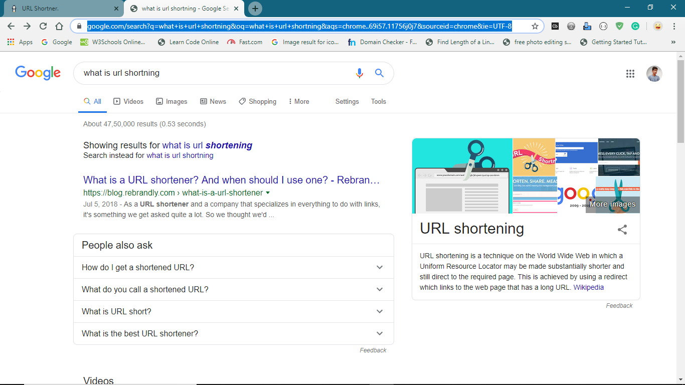
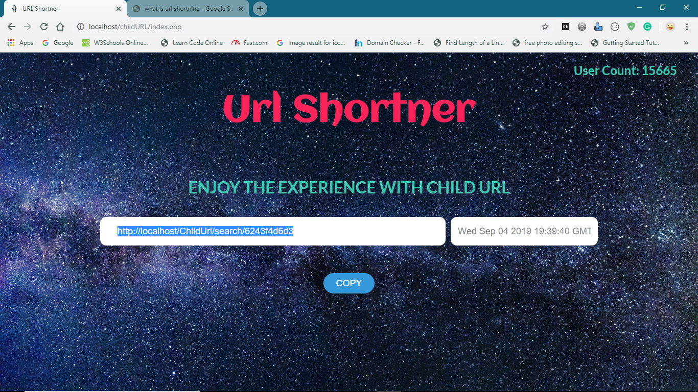
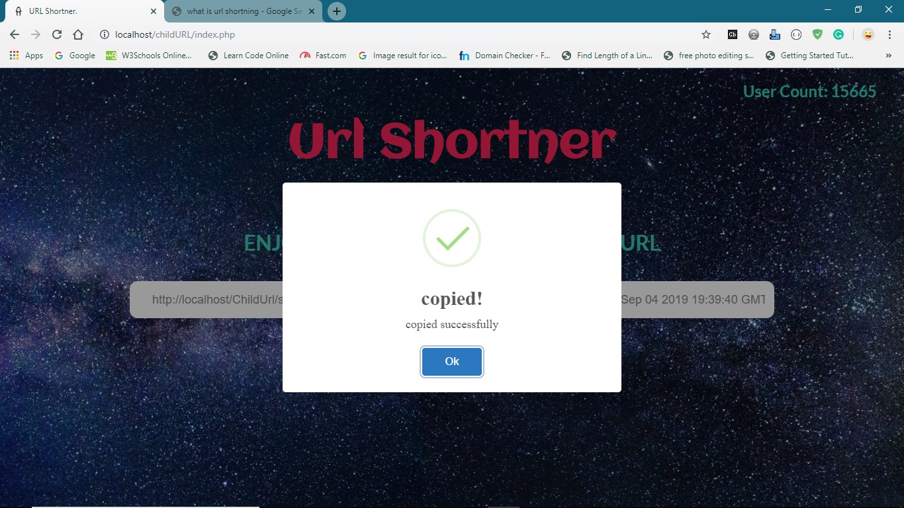
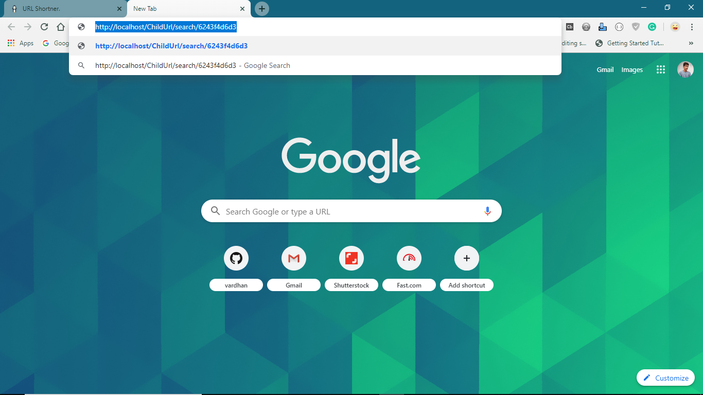
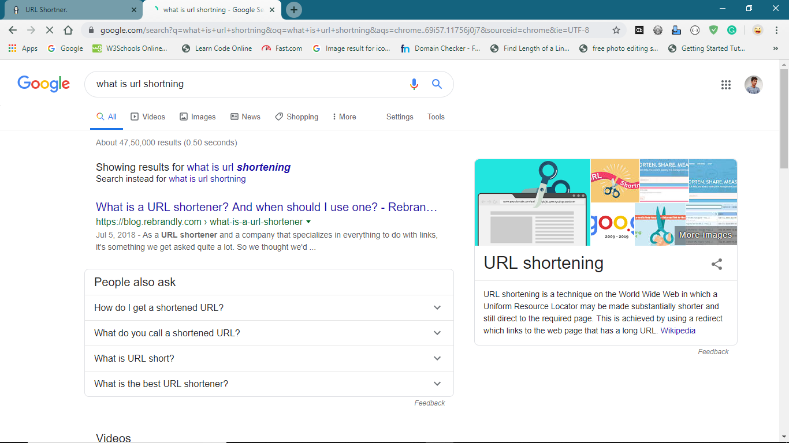

# CHILD URL

## How It Works

### 1. Copy the Link of any website having large url.

### 2. Run childURL web application and paste url in the input field and short it by clicking shorten option.

### 3. You can get shorten url with this website url attached and copy it by clicking on copy option.

### 4. paste it on another new tab.

### 5. Now you redirected to first visited website.

## Contributers
* Sai Vardhan Poloju ([@vardhan-scripter](https://github.com/vardhan-scripter))

* Sri Manikanta Palakollu ([@srimani-programmer](https://github.com/srimani-programmer))
